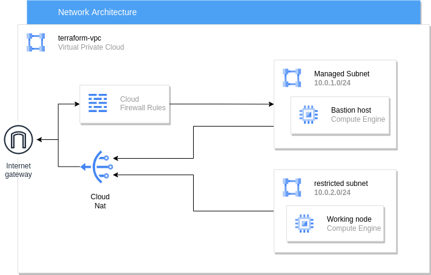

# Private GKE CLuster with Jenkins deployment

## Description

- Google Kubernetes Engine infrastructure and Jenkins deployment

## Requirments

1. Linux based, Windows or Mac os
2. Docker configured for linux containers
3. GKE cluster
4. private virtual machine or a server working as jenkins slave for packaging and deploying the application

## Terraform infrastructure overview

- a vpc, 2 private subnets named restricted and managed, NAT, Router and a firewall to allow ssh to the bastion server
- a private compute instace as a bastion server and a slave node for jenkins
- private GKE cluster.
- 2 service account. one for bastion server that will have access to the cluster control plane  
and service account for the cluster to create and communicate with the nodes  

## Kubernetes deployment overview

1. jenkins-ns which is a namespace for jenkins only
2. jenkins deployment
3. jenkins persistent volume claim to create a persistent volume for the jenkins_home dirctory
4. jenkins load balancer and ClusterIp to expose endpoint for jenkins

## Steps

- created a project on GCP with billing enabled on it
- authenticated gcloud cli to be able to issue commands to the project
- created the terraform files and added the project id in it
- created the infrastructure on GCP using `terraform apply` inside the terraform folder
- started creating the jenkins deployment. kindly read the README inside jenkins folder for the rest of the details

## Author

[Alaa A. Amin](https://www.linkedin.com/in/alaaamin-swe/)
