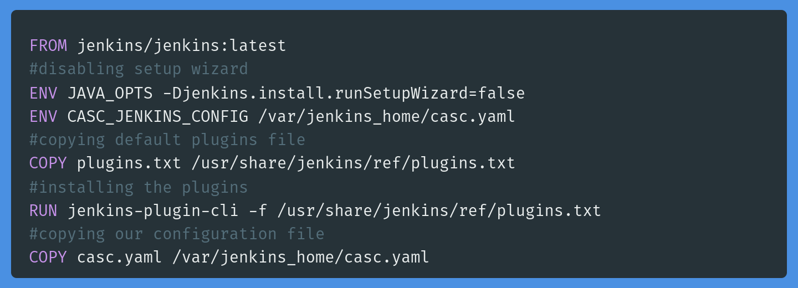
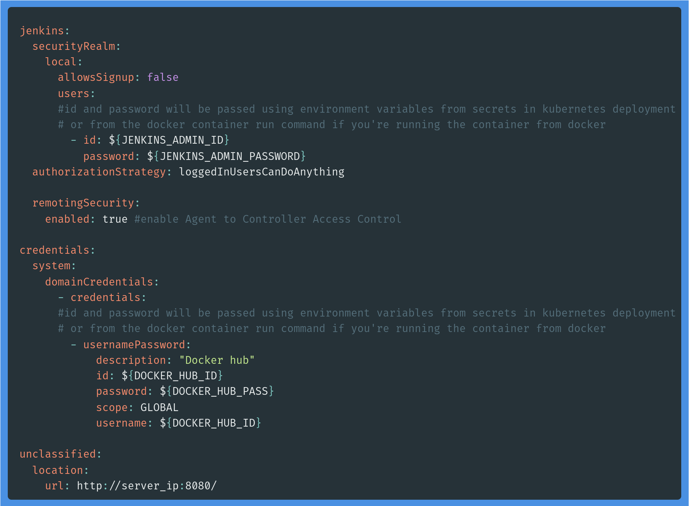
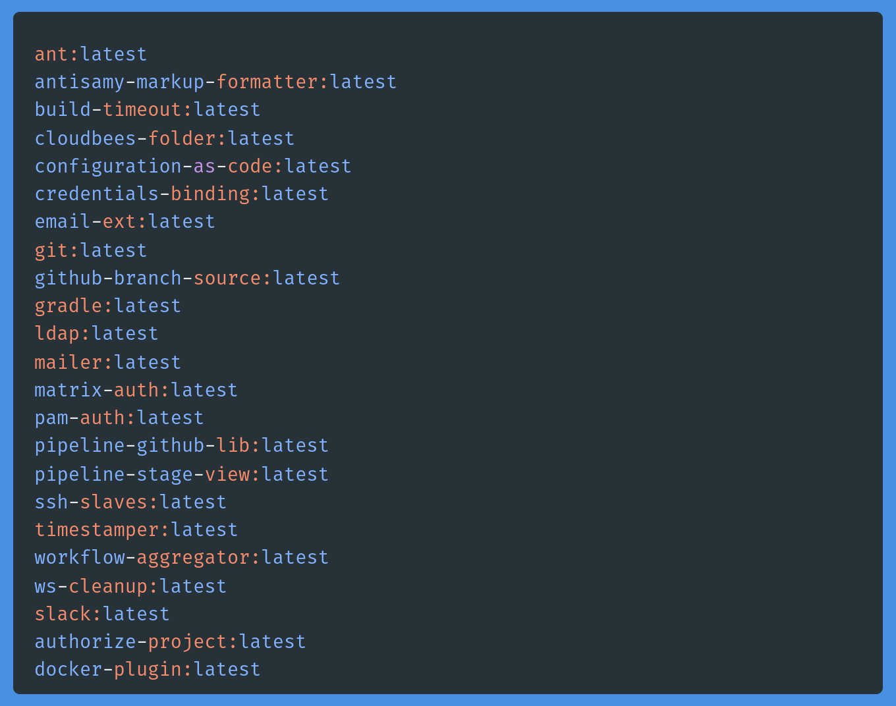

# Jenkins

## Description

- Jenkins custom docker image and kubernetes deployment and configuration files

## Requirments

1. Linux based, Windows or Mac os
2. Docker
3. Any kubernetes cluster or minikube

## Image overview

1. jenkins image Dockerfile based on the official jenkins docker image
2. plugins file that will be used to install the specified jenkins plugins
3. casc file to create a user, choose authorization strategy and create credentials
4. the credentials must be provided through environment variables

## Kubernetes files overview

1. jenkins secrets for the docker image credentials
2. jenkins deployment file
3. jenkins persistent volume and persistent volume claim for the jenkins_home dirctory
4. jenkins service to expose an endpoint for jenkins

## Steps

- created the Dockerfile  
  
- configuration as code file casc.yaml  
 
- plugins file  
 
- built the image using `docker image build -t alaaamin/jenkins:v1.0.5full .`
- pushed the image to Docker Hub `docker push alaaamin/jenkins:v1.0.5full`
- created kuberenets files namespace, deployment, service, secrets, persistent volume and persistent volume claim

## Author

[Alaa A. Amin](https://www.linkedin.com/in/alaaamin-swe/)
