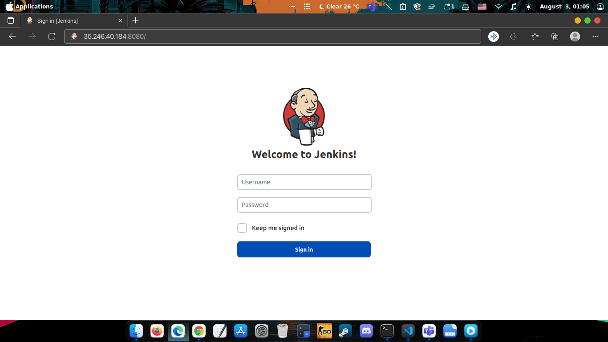
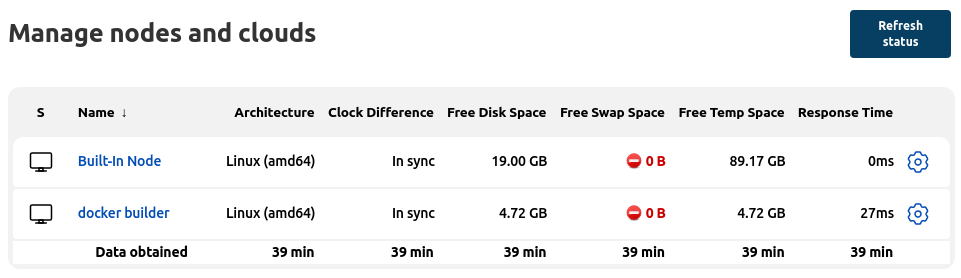
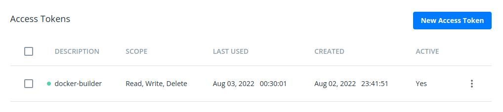
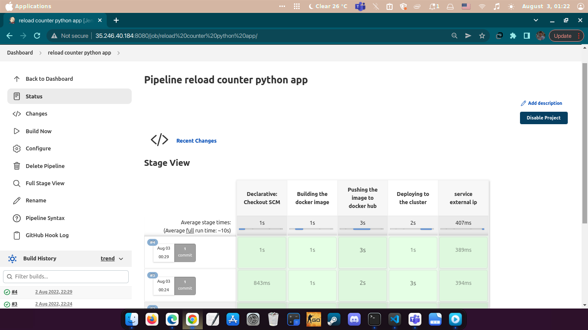
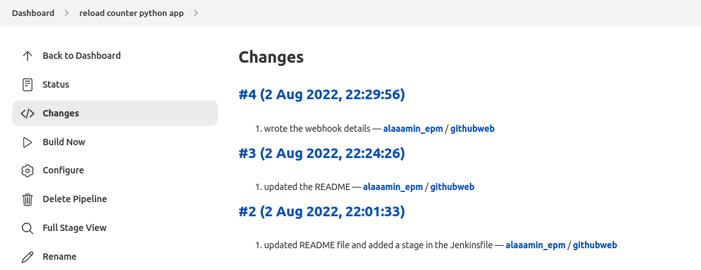
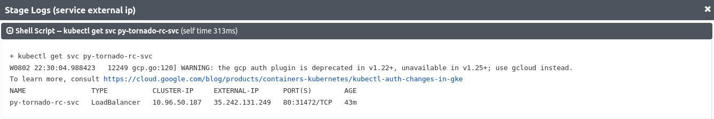
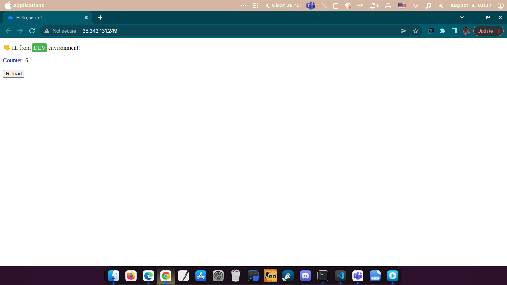

# Jenkins

## Description

- Kubernetes deployment and configuration files for Jenkins

## Requirments

1. Linux based, Windows or Mac os
2. Kubernetes cluster or minikube

## Steps

- after creating the infrastructure and configuring jenkins i uploaded the deployment folder to the bastion vm named gke-bastion using `gcloud compute scp --recurse ./deployment/ gke-bastion:~/ --project="versatile-bolt-354107"`
- ssh into the vm using the command  
`gcloud compute ssh --zone "europe-west2-a" "gke-bastion"  --tunnel-through-iap --project "versatile-bolt-354107"`
- changed the directory to the deployment directory then run `kubectl apply -f jenkins-ns.yaml` to create the namespace then `kubectl apply -Rf .` to run all of the resources
- run `kubectl get services -n jenkins-ns` to get the load balancer external ip.
- the result  

- on the bastion created ssh key using `ssh-keygen` which produced private and public key id_rsa and id_rsa.pub
- added the public key inside the file ~.ssh/authorized_keys
- created a credentials in jenkins of type SSH Username with private key using the logged username and private key
- configured the bastion server as a slave to jenkins using the username with private key credential  

- on the slave node run `sudo gpasswd -a $USER docker` and `newgrp docker` to make docker usable without `sudo` command
- created access token on docker hub to login with it on the machine using `docker login -u <username>`  
  

- voila! it is time now to to make a pipeline and test everything
- made a pipeline with GitHub hook trigger for GITScm polling as its build trigger and pipeline script from SCM
  
  
- change history  
  

- service external ip  
  

- the application  
 

## Author

[Alaa A. Amin](https://www.linkedin.com/in/alaaamin-swe/)
